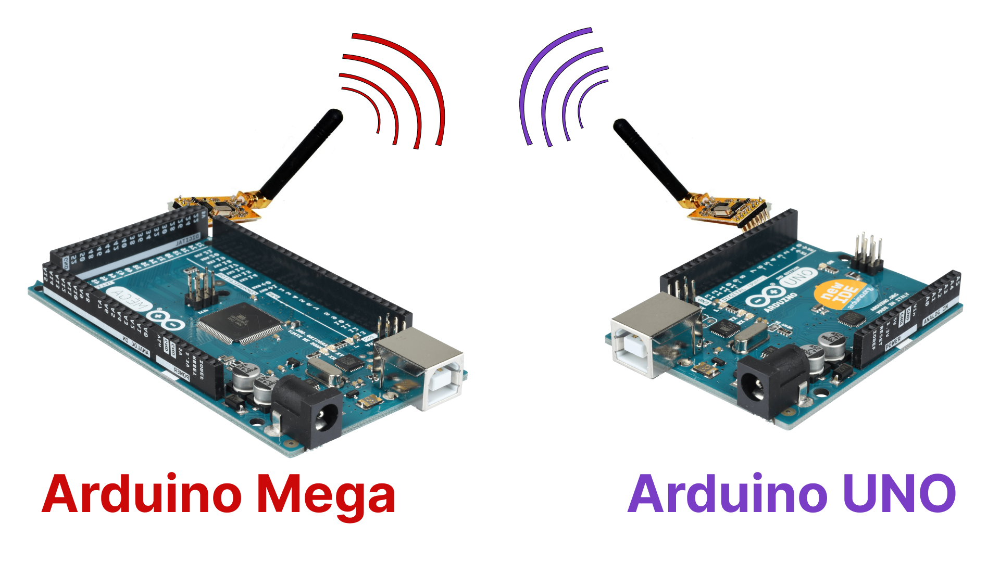

# Comunicacion entre dos placas
## Mediante modulo de radiofrecuencía APC220

# Explicación
Este proyecto pretende explicar de manera sencilla como comunicar dos placas arduino a traves de modulos de raiofrecuencía APC220 de manera sencilla

# Información general

| **Nombre del Módulo**   | Módulo APC220                             |
| ----------------------- | ----------------------------------------- |
| **Frecuencia de Trabajo** | 420 MHz a 450 MHz                        |
| **Voltaje de Alimentación** | 3.5V a 5.5V                             |
| **Corriente**           | <25-35mA                                  |
| **Temperatura de Trabajo** | -20℃ a +70℃                          |
| **Alcance**              | 1200 m en línea de visión (1200 bps)      |
| **Interfaz**            | UART/TTL (Comunicación Serie)             |
| **Velocidad de Datos**   | 1200-19200 bps                           |
| **Velocidad de Datos (aérea)** | 1200-19200 bps                        |
| **Buffer de Recepción**  | 256 bytes                                |
| **Tamaño**               | 37mm × 17mm × 6.6mm                       |
| **Peso**                 | 30g                                      |
| **Documentación Oficial** | [Manual de Usuario APC220](https://wiki.dfrobot.com/APC220_Radio_Data_Module_SKU_TEL0005_) |

# Guia por pasos 