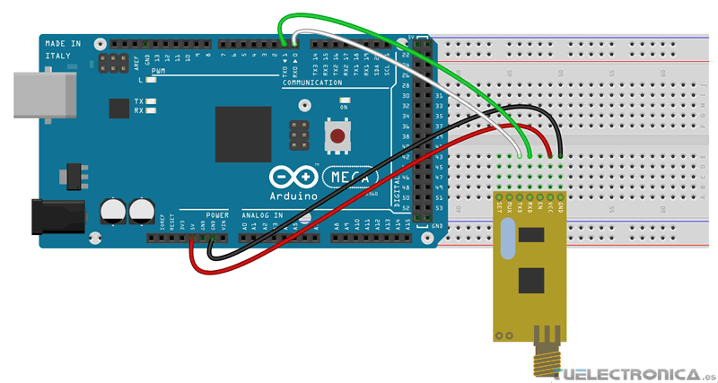

# Armado

El armado es bastante sencillo solo necesitas dos placas

## Conexiones

| **Módulo APC220** | **Arduino Uno** | **Arduino Mega** |
| ----------------- | --------------- | ---------------- |
| GND (Tierra)     | GND             | GND              |
| VCC (5V)         | 5V              | 5V               |
| TXD (Transmit)   | RX   |RX   |
| RXD (Receive)    | TX   | TX   |

## Diagrama
Este es el ejemplo del diagrama con Arduino Mega
