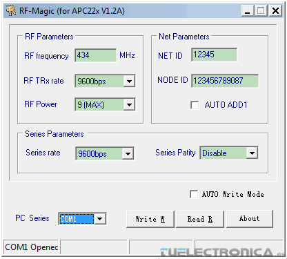
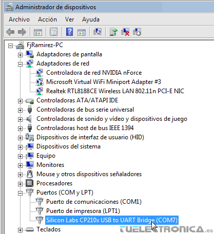
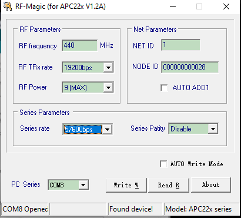

# Configuración

## Instalar RF-magic 
RF-magic es un software para configurar

[Descargar Ejecutabe RF-magic](https://www.dfrobot.com/image/data/TEL0005/rfmagic.rar)

Debes ejecutarlo como administrador y debería verse así. Pero aun nos falta el driver!

## Instalación de driver
Dado que los modulos de radiofrecuencia necesitan ser configurados debemos descargar un driver e instalarlo para esto recomiendo ver el siguiente video

[Enlace del video en youtube](https://youtu.be/r_eMEXvt0v0?si=nLZbkMw5FuaPBv4E)

Una vez instalado el driver debería versé asi

## Configurar modulos

Lo siguiente es que ambos modulos deben tener la misma configuración, para esto puedes simplemente conectarlos y presionar `Write W` pero si prefieres puedes cambiar algunas cosas en nuestro ejemplo lo configuramos asi

Editas los datos asi y le das a `Write W`