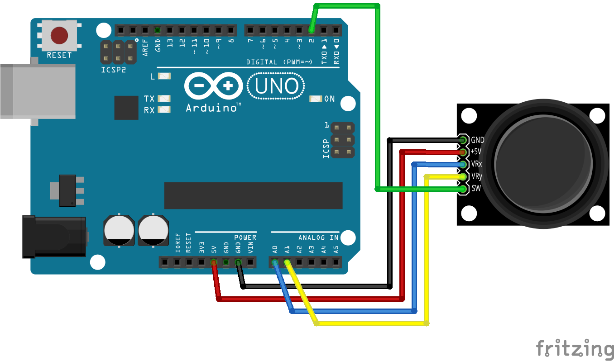

# Leer valores Joystick

En esta guía aprenderas a leer los valores devueltos por el modulo joystick con arduino 


## Requisitos
- ### Hardware
    - Arduino Mega o Arduino Uno *(en este ejemplo usamos una mega)*
    - Cable Arduino A - B
    - Joystick
- ### Software
    - Arduino IDE
    
## Conexiones

| Módulo Joystick | Arduino Uno | Arduino Mega | Arduino Nano |
|-----------------|-------------|-------------|--------------|
| VCC             | 5V          | 5V          | 5V           |
| GND             | GND         | GND         | GND          |
| VRx (eje X)     | A0          | A0          | A0           |
| VRy (eje Y)     | A1          | A1          | A1           |
| SW (botón)      | D7          | D7          | D7           |

Los ejes X e Y están conectados a los pines analógicos A0 y A1 para leer sus valores analógicos, y el botón SW está conectado al pin digital 7. Puedes ajustar las conexiones según tus necesidades, pero estos son los valores típicos.

## Diagrama 
(Con todas las placas sería básicamente lo mismo)



## Programación

```arduino
int Xpin = A1;
int Ypin = A0;
int btnPin = 7;
int xVal;
int yVal;
int btnVal;

void setup() {
  pinMode(Xpin, INPUT);
  pinMode(Ypin, INPUT);
  pinMode(btnPin, INPUT_PULLUP); // Usar resistencia pull-up interna
  Serial.begin(9600);
}

void loop() {
  xVal = analogRead(Xpin);
  yVal = analogRead(Ypin);
  btnVal = digitalRead(btnPin);

  // Puedes realizar acciones basadas en los valores de xVal, yVal y btnVal aquí
  // Por ejemplo, puedes imprimir estos valores en el puerto serie:
  Serial.print("X: ");
  Serial.print(xVal);
  Serial.print(" Y: ");
  Serial.print(yVal);
  Serial.print(" Botón: ");
  Serial.println(btnVal);

  delay(100);
}

```