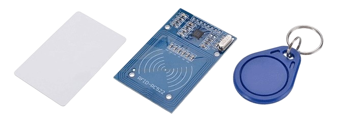
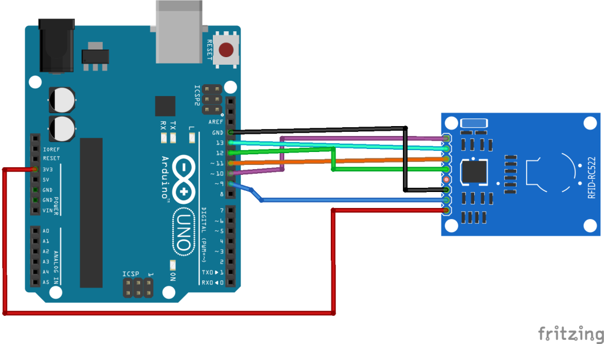
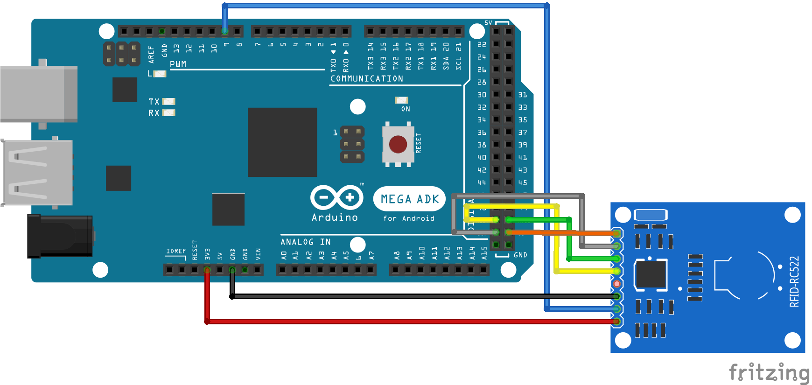

# Leer uid de tarjeta con RFID


Proyecto para armar cicuito que permite usar tecnología  RFID para leer un Id único de una tarjeta, puede ser usado en proyectos de robótica como el de acceso con chapa a una puerta o de asistencia por ejemplo



## Requisitos
- ### Hardware
    - Arduino Mega o Arduino Uno *(en este ejemplo usamos una mega)*
    - Cable Arduino A - B
    - Kit RFID 
        - 1 Módulo Lector RFID-RC522 
        - 1 Tarjeta RFID
        - 1 Barra de 8 pines 
        - **NOTA**: Debes soldar la barra de pines de 90 grados al Módulo
- ### Software
    - Arduino IDE
    - Librería `MFRC522` arduino para control del rfid
    
## Conexiones

| Módulo RFID-RC522 | Arduino Uno | Arduino Mega | Arduino Nano |
|-------------------|-------------|-------------|--------------|
| RST/Reset         | 9           | 5           | D9           |
| SDA (SS)          | 10          | 53          | D10          |
| MOSI              | 11 / ICSP-4  | 51          | D11          |
| MISO              | 12 / ICSP-1  | 50          | D12          |
| SCK               | 13 / ICSP-3  | 52          | D13          |
| IRQ               | No Conectar  | No Conectar | No Conectar  |
| GND               | GND         | GND         | GND          |
| 3.3V              | 3.3V        | 3.3V        | 3.3V         |

## Circuito

### Arduno Uno


### Arduino Mega
 

## Programación

Para levar a cabo la codificación necesitamos la librería MFRC522, una vez con esto podemos continuar con el siguiente codigo

```arduino
#include <SPI.h>
#include <MFRC522.h>

#define RST_PIN         5
#define SS_PIN          53

MFRC522 mfrc522(SS_PIN, RST_PIN);

void setup() {
  Serial.begin(9600);
  while (!Serial);
  SPI.begin();  
  mfrc522.PCD_Init();
  delay(500);
  mfrc522.PCD_DumpVersionToSerial();
  Serial.println(F("Scan PICC to see UID, SAK, type, and data blocks..."));
}

void loop() {
  if (!mfrc522.PICC_IsNewCardPresent()) {
    Serial.println("0"); // Imprime "0" cuando no se encuentra una tarjeta
    delay(1000); // Añade una pausa para no imprimir repetidamente "0"
    return;
  }

  if (!mfrc522.PICC_ReadCardSerial()) {
    return;
  }

  for (byte i = 0; i < mfrc522.uid.size; i++) {
    Serial.print(mfrc522.uid.uidByte[i] < 0x10 ? " 0" : " ");
    Serial.print(mfrc522.uid.uidByte[i], HEX);
  }

  mfrc522.PICC_HaltA();
  // mfrc522.PCD_StopCrypto1();
}
```